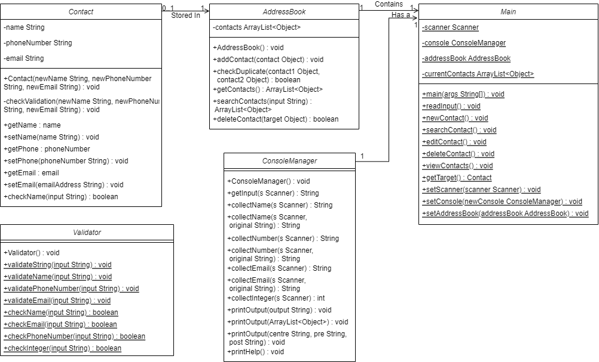
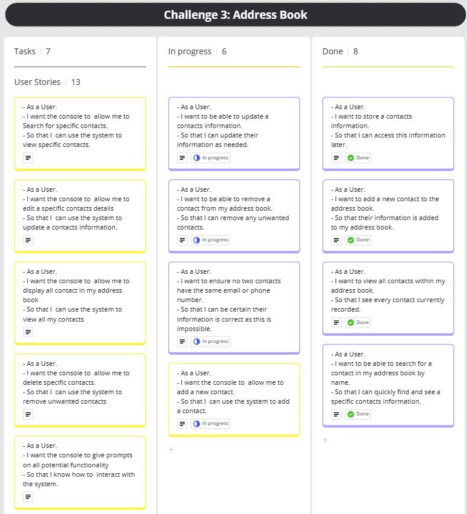
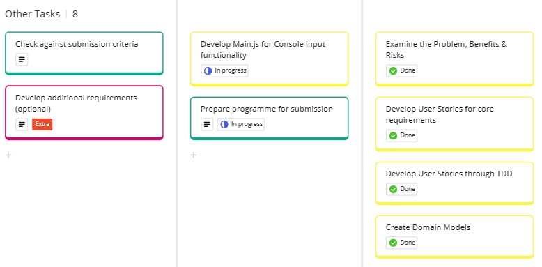
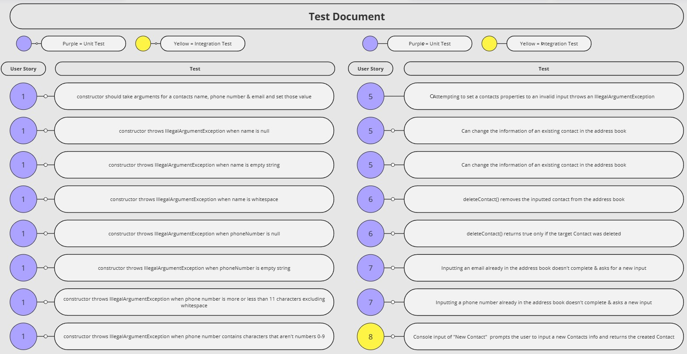
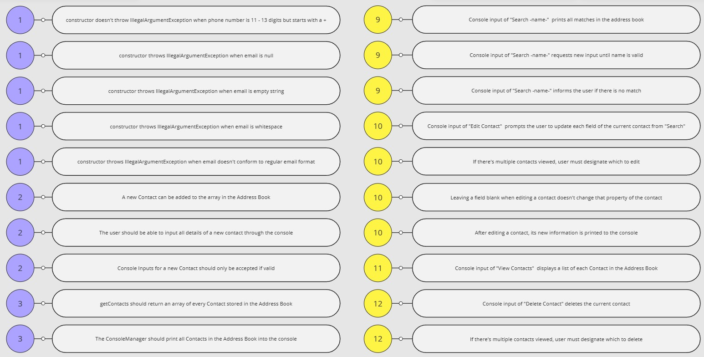
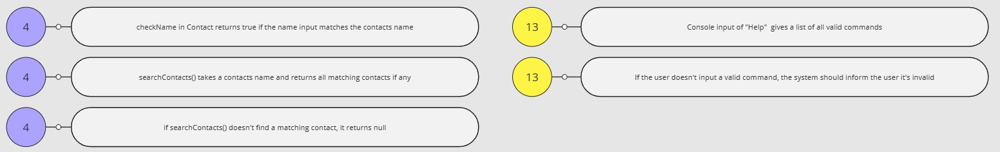

# Domain Models, Class Diagrams and Test Plan

## User Stories
User Stories derived from set of user requirements in documentation:

- **As a User** 
  I want to store a contact's information.
   
  So that I can access this information later.

- **As a User** 
  I want to add a new contact to the address book.
   
  So that their information is added to my address book.

- **As a User** 
  I want to view all contacts within my address book.
   
  So that I see every contact currently recorded.

- **As a User** 
  I want to be able to search for a contact in my address book by name.
   
  So that I can quickly find and see a specific contacts information.

- **As a User** 
  I want to be able to update a contact's information.
   
  So that I can update their information as needed

- **As a User** 
  I want to be able to remove a contact from my address book.
   
  So that I can remove any unwanted contacts.

- **As a User** 
  I want to ensure no two contacts have the same email or phone number.
   
  So that I can be certain their information is correct as this is impossible.

- **As a User** 
  I want the console to  allow me to add a new contact.
   
  So that I  can use the system to add a contact.

- **As a User** 
  I want the console to  allow me to Search for specific contacts.
   
  So that I  can use the system to view specific contacts.

- **As a User** 
  I want the console to  allow me to Edit a specific contacts details
   
  So that I  can use the system to update a contact's information.

- **As a User** 
  I want the console to  allow me to display all contact in my address book
   
  So that I  can use the system to view all my contacts

- **As a User** 
  I want my account to record all deposits as transactions.
   
  So that I can see all the information regarding that deposit.

- **As a User** 
  I want the console to  allow me to delete specific contacts.
   
  So that I  can use the system to remove unwanted contacts

- **As a User** 
  I want the console to give prompts on all potential functionality.
   
  So that I know how to  interact with the system.

## Domain Models
Domain models created from User Stories, ordered to match up with corresponding story in above list:

## Class Diagram
From the constructed Domain Models, below is a class diagram of the entire system:

## Kanban Board
Screenshots of the Kanban board I used to structure the development process:

## Test Documentation
Screenshots of all tests carried out during development. Unit tests are labeled in purple and Integration tests are in yellow.

  
##### Development by Connor Boscherini
